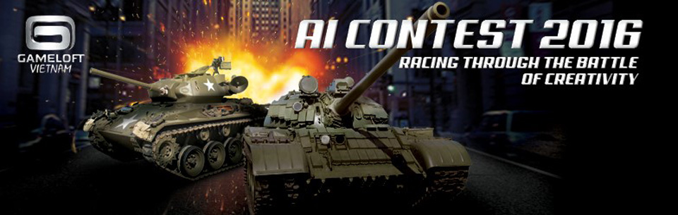
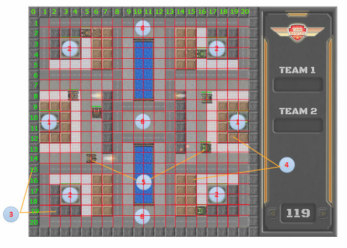

# AI_Tank

	

## Mục lục
- [Giới thiệu](#Giới-thiệu)
    - [Lịch sử](#Lịch-sử-và-phát-triển)
    - [Nền tảng và môi trường](#Nền-tảng-và-môi-trường)
- [Về trò chơi](#Về-trò-chơi)
    - [Bản đồ](#Bản-đồ)
    - [Đối tượng](#Đối-tượng)
    - [Luật chơi](#Luật-chơi)
- [Các cuộc thi](#Các-cuộc-thi)
    - [IT festival](#IT-festival)
    - [HIT Open Day](#HIT-Open-Day)

## Giới thiệu
- AI TANK contest là một cuộc thi lập trình trò chơi điện tử sử dụng trí tuệ nhân tạo kết hợp với lập trình hướng đối tượng. Hằng năm sự kiện này được tổ chức ở một số trường cao đẳng và đại học trong khu vực miền bắc.
- Trong cuộc thi, bạn sẽ phải lập trình (code) trên nền tảng mà nhà phát triển đã cho để di chuyển những con tank phá hủy và tiêu diệt tank, trụ của người chơi khác.

### Lịch sử và phát triển
- AI TANK được tạo ra vào năm 2016 do nhà sáng lập <a href="https://www.gameloft.com/en/">GAMELOFT.</a>&nbsp;&nbsp;&nbsp;.
- Hiện nay có một vài cá nhân và tổ chức đã tạo ra server dành cho riêng cuộc thi này.
### Nền tảng và môi trường
- Sử dụng môi trường Visual Studio 2015 trở lên (2015,2017,2019,...) có cài đặt C++ để lập trình có sẵn platform. [Tải về](https://visualstudio.microsoft.com/fr/vs/)
- Sử dụng môi trường Nodejs để kết nối server giữa các chương trình. [Tải về](https://nodejs.org/en/)

## Về trò chơi

### Bản đồ

CLICK TO SEE

	

CLICK TO SEE

- Bản đồ trong excel: <a href="Media/Map.xlsx" download>Click to Download</a>

### Đối tượng
- Giới thiệu đối tượng: <a href="Media/Instruction.pptx" download>Click to Download</a>
- Chỉ số đối tượng: <a href="Media/README.txt" download>Click to Download</a>
### Luật chơi
- Trong game đấu 2 đội chơi, mỗi đội sẽ được chọn ngẫu nhiên một bên xe tăng TEAM_1 hoặc TEAM_2.
- Hiệp chính
	- Để dành được chiến thắng tuyệt đối, đội chơi sẽ phải phá hủy trụ chính hoặc toàn bộ xe tăng của đội bạn.

		- Trụ chính:

		

			
				
		

		- Tăng

		

			
			
			
			
			
			
			
			
		

	- Nếu kết thúc thời gian (thời gian = 0) mà trụ chính hoặc tăng của 2 đội vẫn còn thì xét đến trụ phụ. Trụ phụ bên nào nhiều hơn thì đội đó sẽ dành chiến thắng.
		
		- Trụ phụ:
		
		

			
			
			
			
		

- Hiệp phụ: Hiệp phụ sẽ xuất hiện khi thời gian đếm đến giây thứ 0 mà cả 2 đội vẫn chưa đội nào giành phần thắng trong hiệp chính.
	- Nếu trong hiệp phụ mà trụ phụ bên nào nhiều hơn thì đội đó sẽ giành chiến thắng ngay lập tức.
	- Kết thúc hiệp phụ mà 2 đội đều còn số trụ chính, trụ phụ bằng nhau. Trò chơi sẽ xét đến số con tăng còn sống mỗi đội trên bản đồ. Đội có nhiều tăng sống hơn sẽ chiến thắng.

## Các cuộc thi
### IT festival
- IT festival (viết tắt của Infomation Technology festival) là ngày hội của toàn thể khoa CNTT. Ngày hội này được tạo ra nhằm mục đích đào tạo, tìm kiếm nhân tài và tạo ra sân chơi bổ ích cho các lập trình (sinh) viên.
- Nói riêng về AI_Tank thì đây có lẽ là cơ hội lớn nhất của những người tham gia do ngày này hằng năm, GAMELOFT sẽ là nhà tài trợ chính. Rất nhiều phần quà đang chờ đợi các ứng cử viên tham gia vào phần thi này.
### HIT Open Day
- HIT Open Day là sự kiện do clb tin học HIT, trường ĐHCNHN tổ chức nhằm tạo ra sân chơi đồng thời phát triển thêm cho cuộc thi lập trình AI_Tank.
